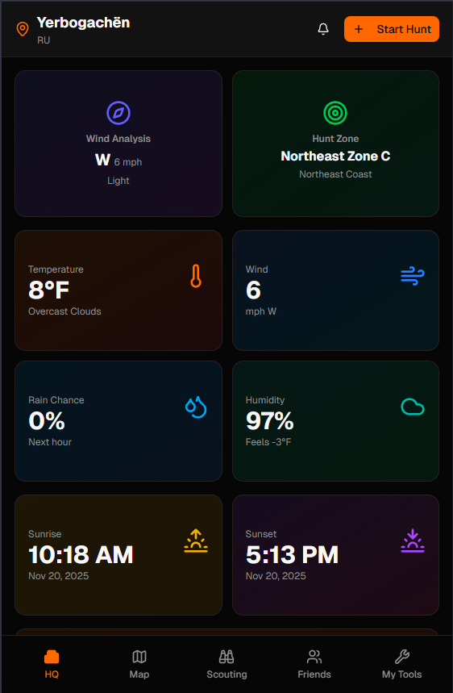

# Camo & Ammo Mobile App 👋
Expo + React Native mobile app and Convex Backend

This is an [Expo](https://expo.dev) project with [Convex](https://convex.dev) backend, created with [`create-expo-app`](https://www.npmjs.com/package/create-expo-app).

## Tech Stack

- **Frontend**: Expo Router, React Native, NativeWind (Tailwind CSS)
- **Backend**: Convex (real-time database and serverless functions)
- **Authentication**: Convex Auth with Google OAuth and Email/Password with OTP verification
- **Styling**: NativeWind v4 (Tailwind CSS for React Native)

## Screenshots

### Dashboard



## Get started

### 1. Install dependencies

```bash
npm install
```

### 2. Set up Convex Backend

#### Install Convex CLI (if not already installed)

```bash
npm install -g convex
```

#### Login to Convex

```bash
npx convex login
```

#### Initialize/Deploy Convex

```bash
npx convex dev
```

This will:

- Create a new Convex project (if first time)
- Deploy your backend functions
- Start the Convex dev server
- Generate environment variables

### 3. Configure Environment Variables

Create a `.env` file in the root directory with the following variables:

```env
# Convex
EXPO_PUBLIC_CONVEX_URL=your_convex_url_here

# Convex Backend Environment Variables (set in Convex dashboard)
# These are set in your Convex project settings, not in .env:
# - GOOGLE_CLIENT_ID
# - GOOGLE_CLIENT_SECRET
# - AUTH_EMAIL
# - AUTH_RESEND_KEY
# - CONVEX_SITE_URL
```

**Note**: Backend environment variables (like `GOOGLE_CLIENT_ID`, `AUTH_RESEND_KEY`, etc.) should be configured in your Convex dashboard under Project Settings → Environment Variables.

### 4. Start the app

```bash
npx expo start
```

In the output, you'll find options to open the app in a

- [development build](https://docs.expo.dev/develop/development-builds/introduction/)
- [Android emulator](https://docs.expo.dev/workflow/android-studio-emulator/)
- [iOS simulator](https://docs.expo.dev/workflow/ios-simulator/)
- [Expo Go](https://expo.dev/go), a limited sandbox for trying out app development with Expo

You can start developing by editing the files inside the **app** directory. This project uses [file-based routing](https://docs.expo.dev/router/introduction).

## Get a fresh project

When you're ready, run:

```bash
npm run reset-project
```

This command will move the starter code to the **app-example** directory and create a blank **app** directory where you can start developing.

## Convex Backend

This project uses [Convex](https://convex.dev) as the backend, providing:

- **Real-time database**: Automatic reactivity and real-time updates
- **Serverless functions**: Backend logic in TypeScript
- **Authentication**: Built-in auth with Convex Auth
- **File storage**: Built-in file uploads and storage

### Backend Structure

The `convex/` directory contains:

- **`auth.ts`**: Authentication configuration with Google OAuth and Email/Password providers
- **`schema.ts`**: Database schema definitions
- **`users.ts`**: User management functions
- **`profile.ts`**: User profile operations
- **Other modules**: Various domain-specific functions (hunts, tracks, forums, etc.)

### Authentication Features

- **Google OAuth**: Sign in with Google account
- **Email/Password**: Traditional email and password authentication
- **OTP Verification**: 4-digit code sent via email for account verification
- **Password Reset**: Email-based password reset functionality

### Running Convex Development Server

To run the Convex backend in development mode:

```bash
npx convex dev
```

This will:

- Watch for changes in `convex/` directory
- Automatically deploy changes
- Show logs and errors in real-time
- Sync your local schema with the database

### Convex Dashboard

Access your Convex dashboard at: https://dashboard.convex.dev

From the dashboard you can:

- View and query your database
- Monitor function logs
- Configure environment variables
- Manage deployments

## Learn more

### Expo Resources

- [Expo documentation](https://docs.expo.dev/): Learn fundamentals, or go into advanced topics with our [guides](https://docs.expo.dev/guides).
- [Learn Expo tutorial](https://docs.expo.dev/tutorial/introduction/): Follow a step-by-step tutorial where you'll create a project that runs on Android, iOS, and the web.

### Convex Resources

- [Convex documentation](https://docs.convex.dev/): Learn about Convex backend development
- [Convex Auth guide](https://docs.convex.dev/auth): Authentication with Convex Auth
- [Convex React guide](https://docs.convex.dev/client/react): Using Convex with React/React Native

## Join the community

Join our community of developers creating universal apps.

- [Expo on GitHub](https://github.com/expo/expo): View our open source platform and contribute.
- [Expo Discord community](https://chat.expo.dev): Chat with Expo users and ask questions.
- [Convex Discord](https://convex.dev/community): Join the Convex community for backend discussions.
